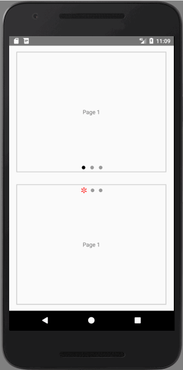
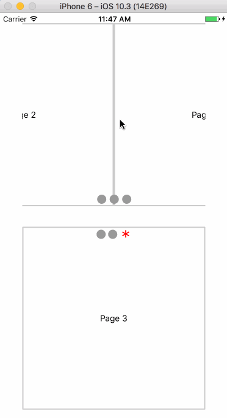

# react-native-carousel-view

react-native carousel, work on both `iOS` and `android`, test on RN >= 0.45 (if this work on earlier version, please open an issue. And will add here)

## Install

```js
npm install react-native-carousel-view
```

**NOTE**: styling in iOS and Android is slightly [different](#difference)

## Demo
<table>
  <tr>
    <th>
      Android
    </th>
    <th>
      iOS
    </th>
  </tr>
  <tr>
    <td>
      
    </td>
    <td>
      
    </td>
  <tr>
</table>

## Props

```js
type Props = {
  hideIndicators: boolean, // Set to true to hide the indicators
  indicatorColor: string, // Active indicator color
  indicatorSize: number, // Indicator bullet size
  inactiveIndicatorColor: string, // Inactive indicator color
  indicatorAtBottom: boolean, // Set to false to show the indicators at the top
  indicatorOffset: number, // Indicator relative position from top or bottom
  indicatorText: string, // Active indicator content ( You can customize to use any Unicode character )
  inactiveIndicatorText: string, // Inactive indicator content ( You can customize to use any Unicode character )
  width: ?number, // the width of the carousel
  height: number, // the height of the carousel
  initialPage: number, // initial start page
  indicatorSpace: number, // space between each indicator
  animate: boolean, // Enable carousel autoplay
  delay: number, // Set Animation delay between slides
  loop: boolean, // Allow infinite looped animation. Depends on Prop {...animate} set to true.
  contentContainerStyle?: {[attr: string]: any}, // content container style, in `Android` this will pass to ViewPagerAndroid style props, in `iOS` this will pass to ScrollView contentContainerStyle props.
  children: any,
  onPageChange?: (number) => void, // Called when the active page changes
  onScrollBegin?: () => void, // Called when scroll begin
  onScroll?: () => void, // Called while scrolling
}
```

default props:

```js
static defaultProps = {
  hideIndicators: false,
  indicatorColor: '#000000',
  indicatorSize: 20,
  inactiveIndicatorColor: '#999999',
  indicatorAtBottom: true,
  indicatorOffset: 0,
  indicatorText: '•',
  inactiveIndicatorText: '•',
  width: null,
  height: 200,
  initialPage: 0,
  indicatorSpace: 10,
  animate: true,
  delay: 1000,
  loop: true,
}
```

## Examples

Simple example (iOS and android is slightly different), see in [Difference](#Difference) section.

```js

import React, {Component} from 'react';
import {
  StyleSheet,
  Text,
  View,
  AppRegistry,
} from 'react-native';
import Carousel from 'react-native-carousel-view';

export default class example extends Component {
  render() {
    return (
      <View style={{
        flex: 1,
        justifyContent: 'center',
        alignItems: 'center',
      }}>
        <View style={styles.container}>
          <Carousel
            width={375}
            height={300}
            delay={2000}
            indicatorAtBottom={false}
            indicatorSize={20}
            indicatorText="✽"
            indicatorColor="red"
            >
            <View style={styles.contentContainer}>
              <Text>Page 1</Text>
            </View>
            <View style={styles.contentContainer}>
              <Text>Page 2</Text>
            </View>
            <View style={styles.contentContainer}>
              <Text>Page 3</Text>
            </View>
          </Carousel>
        </View>
      </View>
    );
  }
}

const styles = StyleSheet.create({
  container: {
    flex: 0.5,
    justifyContent: 'center',
    alignItems: 'center',
  },
  contentContainer: {
    borderWidth: 2,
    borderColor: '#CCC',
    flex: 1,
    justifyContent: 'center',
    alignItems: 'center',
  },
});


AppRegistry.registerComponent('example', () => example);
```

- Android: [Example](./example/index.android.js)

- iOS: [Example](./example/index.ios.js)

## Difference

In `Android` the carousel effect use `ViewPagerAndroid`, on the other hand, in `iOS` use `ScrollView`.  Due to the mechanism difference between iOS and Android so the styles settings is slightly different.

The `contentContainerStyle` props should be set in different settings if you want to have the same appearance in iOS and Android.

In iOS `contentContainerStyle` means the container of the child.
This is an example.

```js
<Carousel
  width={375}
  height={300} // =====> the container will be height 300
  >
  <View style={{height: 200, width: 300}}> // ===> child height 200, width 300. if the children's height and width is not set width and height from Carousel component will set to children.
    <Text>Page 1</Text>
  </View>
  <View style={{height: 200, width: 300}}> // ===> child height 200, width 300
    <Text>Page 2</Text>
  </View>
  <View style={{height: 200, width: 300}}> // ===> child height 200, width 300
    <Text>Page 3</Text>
  </View>
</Carousel>
```

but in Android it means it is the children's 
view style. According to the react-native docs https://facebook.github.io/react-native/docs/viewpagerandroid.html

> Container that allows to flip left and right between child views. Each child view of the ViewPagerAndroid will be treated as a separate page and will be stretched to fill the ViewPagerAndroid.
>It is important all children are <View>s and not composite components. You can set style properties like padding or backgroundColor for each child.

```js
<Carousel
  width={375}
  height={300} // =====> the container will be height 300
  >
  <View style={{height: 200}}> // ===> child height will still be 300, and width will automatically be 375 and can't be changed
    <Text>Page 1</Text>
  </View>
  <View style={{height: 200}}> // ===> child height will still be 300, and width will automatically be 375 and can't be changed
    <Text>Page 2</Text>
  </View>
  <View style={{height: 200}}> // ===> child height will still be 300, and width will automatically be 375 and can't be changed
    <Text>Page 3</Text>
  </View>
</Carousel>
```

## Develop

go to `example` folder and enter `yarn install` and `yarn run haul`

select your platform:

```
➜  example git:(master) yarn run haul
yarn run v0.27.5
$ haul start
? Select platform to bundle for (Use arrow keys)
❯ ios - Serves iOS bundle
  android - Serves Android bundle
  all - Serves both platforms
```

and run `react-native run-ios` or `react-native run-android` to open simulators.

## See also

- https://github.com/Canner/react-native-image-page - a react-native image carousel, with zoom-pan gestures and full-screen support, work on both iOS and Android

## NOTE

this repo is original from https://github.com/nick/react-native-carousel with lots of improvements.

## License

Apache 2.0
